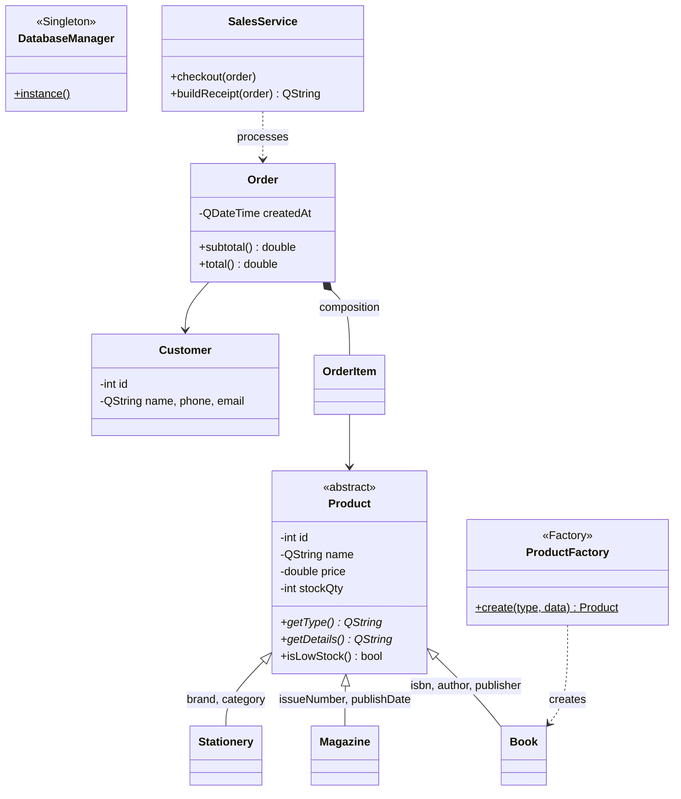

# Tóm tắt project:
- Xây dựng một ứng dụng quản lý hoàn chỉnh theo chủ đề tự chọn có GUI(Giao diện đồ họa)
- Được dùng AI để hỗ trợ nhưng phải hiểu code, khi dùng AI thì phải có nhật ký, định dạng nhật ký đề xuất của giáo viên: 
- Giảng viên có thể đặt câu hỏi vấn đáp riêng cho từng sinh viên để kiểm tra mức độ hiểu bài và sự đóng góp của mỗi người.

# KẾ HOẠCH ĐỒ ÁN OOP — BOOKSTORE MANAGEMENT SYSTEM

## PHÂN CÔNG
### Nguyễn Phúc Lộc — điều phối
- Dựng skeleton kiến trúc: models (Product + 3 lớp con, Customer, Order), DatabaseManager (Singleton) + schema SQL, ProductFactory, MainWindow (điều hướng tab)
- Review + merge mọi PR, giải conflict, ghép module tuần cuối
- Lập repo GitHub + task board, quản tiến độ nhóm
- Report: chương System Design (UML + design patterns)
- Video: giải thích UML + design patterns

### Vũ Bình Nguyên — Module Sản phẩm
- ProductRepository: CRUD + search + lọc + trừ kho (decrementStock)
- ProductPage: bảng + tìm kiếm + lọc theo loại + cảnh báo sắp hết hàng
- Dialog form Thêm/Sửa (field đổi theo loại SP) + validate
- Report: chương Implementation & Testing + tổng hợp/format file PDF cuối
- Video: demo module sản phẩm

### Lê Quốc Đạt — Module Khách hàng
- CustomerRepository: CRUD + search
- CustomerPage: bảng + form Thêm/Sửa + validate
- Slide thuyết trình toàn bộ (nhận nội dung từ các bạn)
- Report: chương Group Intro + Problem Domain & Requirements

### Võ Viết Tân — Bán hàng POS
- SalesService: checkout (kiểm kho → tính tổng → lưu đơn → trừ kho) + buildReceipt (hoá đơn)
- OrderRepository: lưu đơn (transaction) + đọc theo khoảng ngày
- SalesPage: tìm SP → thêm vào giỏ → thanh toán → hiện hoá đơn
- Report: mô tả business logic bán hàng
- Video: demo bán hàng + hoá đơn (phần đinh của demo)

### Quách Hiền Lương — Thống kê & Báo cáo
- ReportService: tổng doanh thu, doanh thu theo ngày, top sản phẩm bán chạy
- StatisticsPage: vài con số thống kê + bảng doanh thu theo ngày + bảng top bán chạy
- Seed data demo (sản phẩm, khách hàng, vài đơn hàng)
- Video: kịch bản + quay + dựng toàn bộ
- Report: chương Challenges & Future + gom AI usage log 5 người

### Việc cá nhân
- AI usage log riêng của mỗi người (ghi NGAY mỗi lần dùng AI)
- Xuất hiện trong video, thuyết trình phần mình làm
- Chuẩn bị vấn đáp: giải thích được code + pattern + UML module của mình

## TIMELINE HOÀN THÀNH PROJECT

- 10/07: Mọi người phải clone và build được skeleton.
- 20/07: Xong phần repository/data của module mình.
- 27/07: Xong UI chính của module mình.
- 31/07: App phải chạy được flow demo đầy đủ.
- 01/08: Code freeze, không thêm tính năng mới.
- 04–05/08: Hoàn thiện report + slide.
- 06/08: Quay video.
- 07/08: Đóng gói và nộp.

## QUY ƯỚC GIAO DIỆN & TÍCH HỢP

- Toàn bộ giao diện dùng chung style trong `src/ui/AppStyle.h` và `src/ui/AppStyle.cpp`.
- Không tự chọn màu/font riêng trong từng module.
- Không setStyleSheet riêng lung tung trong từng page.
- MainWindow và style chung do Lộc quản lý.
- Mỗi page dùng layout chung: tiêu đề, thanh tìm kiếm/bộ lọc/nút thêm, bảng dữ liệu, dialog thêm/sửa.
- Nút dùng tên thống nhất: Add, Edit, Delete, Search, Save, Cancel.
- Không tự ý đổi tên class, tên hàm public, tên file hoặc database schema nếu chưa báo nhóm.
- UI chỉ gọi Service hoặc Repository, không viết SQL trực tiếp trong UI.
- Repository phụ trách đọc/ghi database.
- Service phụ trách business logic.
- Mỗi PR phải build được trước khi gửi review.
- Trước khi code mỗi ngày phải pull main mới nhất.

## PHẦN 1 — CÁCH DÙNG GIT/GITHUB 

Điểm cá nhân được chấm dựa trên **commit history** — commit của bạn chính là bằng chứng đóng góp. Không commit = không có bằng chứng = mất điểm.

### 1.1. Cài đặt lần đầu

```bash
# Cài Git: tải tại https://git-scm.com/download/win

# Khai báo danh tính — DÙNG TÊN THẬT + EMAIL GITHUB CỦA BẠN
# (giảng viên nhìn tên này để chấm điểm cá nhân!)
git config --global user.name "Nguyen Van A"
git config --global user.email "email-cua-ban@gmail.com"

# Clone repo về máy
git clone https://github.com/nguyenphucloc229/Bookstore-Management-System.git
cd Bookstore-Management-System
```

### 1.2. Quy trình làm việc hàng ngày

```bash
# BƯỚC 1: luôn cập nhật code mới nhất trước khi làm
git checkout main
git pull origin main

# BƯỚC 2: tạo nhánh riêng cho task (KHÔNG BAO GIỜ code thẳng trên main)
git checkout -b feature/product-crud

# BƯỚC 3: code... rồi xem mình đã sửa gì
git status
git diff

# BƯỚC 4: commit — mỗi khi xong 1 phần nhỏ chạy được, commit NHỎ và THƯỜNG XUYÊN
git add .
git commit -m "[product] Thêm chức năng tìm kiếm theo tên"

# BƯỚC 5: đẩy nhánh lên GitHub
git push -u origin feature/product-crud

# BƯỚC 6: lên GitHub -> bấm "Compare & pull request" -> tạo Pull Request
# -> nhắn Lộc review -> Lộc merge vào main
```

### 1.3. Quy tắc commit message

```
[module] Mô tả ngắn việc đã làm

Ví dụ:
[product]  Thêm dialog form nhập sách
[sales]    Sửa lỗi tính sai tổng tiền khi giảm giá
[customer] Validate số điện thoại
[docs]     Cập nhật AI usage log tuần 2
```

### 1.4. Khi bị conflict (2 người sửa cùng 1 chỗ)

```bash
git checkout main && git pull origin main
git checkout feature/nhanh-cua-ban
git merge main
# Git báo file conflict -> mở file, tìm dấu <<<<<<< ======= >>>>>>>
# -> giữ đoạn code đúng, xoá các dấu đó -> lưu
git add .
git commit -m "[merge] Giải quyết conflict với main"
git push
```

> Mẹo tránh conflict: mỗi người CHỈ sửa file thuộc module mình phụ trách (Phần 5). Cần sửa file người khác → nhắn group trước.

### 1.5. Luật chung

| Luật | Lý do |
|---|---|
| Không push thẳng lên `main` — chỉ Lộc merge PR | main phải luôn build được |
| Commit ít nhất 2–3 lần/tuần | Bằng chứng đóng góp đều đặn |
| Commit bằng tên thật, đúng email GitHub | Giảng viên chấm theo commit history |
| Ghi AI usage log NGAY khi dùng AI | Log phải khớp commit history, cuối kỳ không bịa lại được |
| Trước khi tạo PR: build + chạy thử không lỗi | Không phá code người khác |

---

## PHẦN 2 — TECH STACK

| Hạng mục | Lựa chọn | 
|---|---|
| Ngôn ngữ | C++ |
| GUI | **Qt 6 (Qt Widgets)** | 
| Build | CMake |
| IDE | Qt Creator |
| Lưu dữ liệu | **SQLite** (module QtSql có sẵn) |

## PHẦN 3 — KIẾN TRÚC & THIẾT KẾ OOP

### 3.1. Kiến trúc phân tầng

```
src/
├── models/        Class OOP thuần: Product, Book, Person, Order...
├── factories/     ProductFactory              [Pattern: Factory]
├── db/            DatabaseManager             [Pattern: Singleton]
├── repositories/  Đọc/ghi SQLite — UI không viết SQL trực tiếp
├── services/      Business logic: bán hàng (checkout, hoá đơn), thống kê
└── ui/            Các màn hình Qt Widgets
```

Luồng gọi: `ui → services → repositories → db`.

### 3.2. Sơ đồ lớp (UML)




