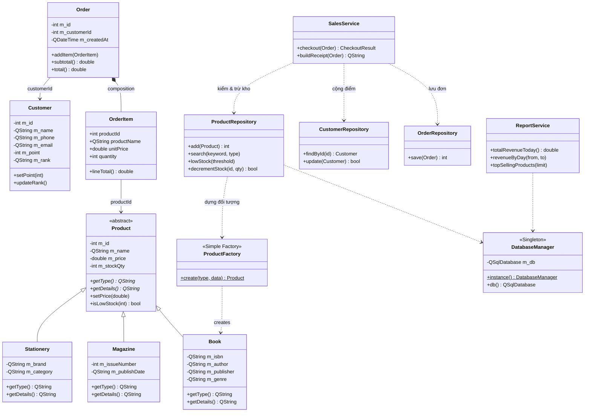
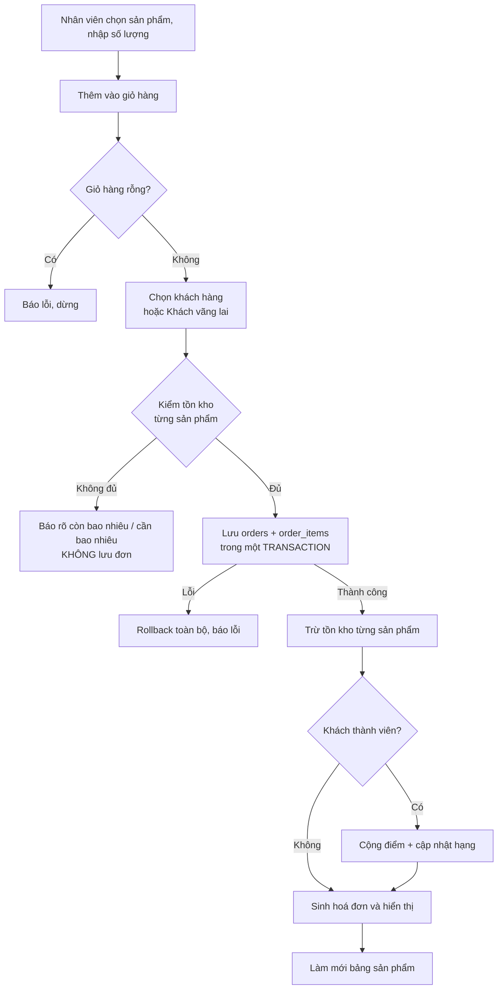

# Báo cáo — Chương c & d: System Design and Architecture

> Người viết: Nguyễn Phúc Lộc (Member 1)
> Bản nháp để đưa vào file `[GroupID - Report].pdf`. Gửi Vũ Bình Nguyên ghép.

---

# c. System Design

## c.1. Tổng quan hệ thống

Bookstore Management System là ứng dụng desktop quản lý nhà sách, được xây dựng bằng
**C++17** với thư viện giao diện **Qt 6 (Qt Widgets)**, hệ quản trị cơ sở dữ liệu **SQLite**
(thông qua module `QtSql`) và công cụ build **CMake**. Toàn bộ mã nguồn gồm khoảng
**3.600 dòng**, chia thành 6 tầng chức năng.

Hệ thống phục vụ nghiệp vụ của một nhà sách quy mô nhỏ với bốn nhóm chức năng chính:
quản lý sản phẩm, quản lý khách hàng, bán hàng tại quầy (POS) và thống kê doanh thu.

## c.2. Các lớp chính và quan hệ

### c.2.1. Cây kế thừa `Product`

Đây là trục thiết kế hướng đối tượng của hệ thống. Lớp `Product` là **lớp trừu tượng**
(abstract class) mô tả những thuộc tính chung của mọi mặt hàng trong nhà sách: mã, tên,
giá bán và số lượng tồn kho. Lớp này khai báo hai hàm thuần ảo:

```cpp
virtual QString getType() const = 0;
virtual QString getDetails() const = 0;
```

Ba lớp con kế thừa và định nghĩa lại hai hàm trên theo đặc thù riêng:

| Lớp con | Thuộc tính riêng | `getType()` |
|---|---|---|
| `Book` | ISBN, tác giả, nhà xuất bản, thể loại | `"BOOK"` |
| `Magazine` | số phát hành, ngày phát hành | `"MAGAZINE"` |
| `Stationery` | thương hiệu, phân loại | `"STATIONERY"` |

Nhờ cơ chế hàm ảo, khi hệ thống duyệt một danh sách `Product*` và gọi `getDetails()`,
chương trình tự động thực thi phiên bản của đúng lớp con tại thời điểm chạy — đây chính
là **tính đa hình** (runtime polymorphism).

### c.2.2. Lớp `Customer`

Lớp `Customer` lưu thông tin liên hệ của khách hàng, đồng thời quản lý hệ thống tích luỹ
gồm hai thuộc tính `point` (điểm) và `rank` (hạng thành viên). Hạng không được nhập tay
mà **tự suy ra từ điểm** thông qua phương thức `updateRank()`:

| Điểm tích luỹ | Hạng |
|---|---|
| ≥ 1000 | Gold |
| ≥ 500 | Silver |
| < 500 | Regular |

Cách thiết kế này bảo đảm dữ liệu luôn nhất quán: không thể tồn tại trường hợp khách có
50 điểm nhưng mang hạng Gold.

### c.2.3. Lớp `Order` và `OrderItem`

Một đơn hàng (`Order`) chứa nhiều dòng hàng (`OrderItem`) theo quan hệ **composition**:
`Order` sở hữu trực tiếp một `QVector<OrderItem>`, và các dòng hàng không tồn tại độc lập
bên ngoài đơn hàng chứa nó.

Mỗi `OrderItem` lưu lại **bản chụp** tên sản phẩm và đơn giá tại thời điểm bán, thay vì chỉ
tham chiếu tới sản phẩm. Điều này bảo đảm hoá đơn cũ vẫn hiển thị đúng giá đã bán ngay cả
khi sản phẩm được đổi giá về sau — một yêu cầu thực tế của nghiệp vụ bán lẻ.

## c.3. Sơ đồ lớp (UML Class Diagram)



## c.4. Luồng hoạt động chính (Main use-case flow)

Nghiệp vụ trung tâm của hệ thống là **quy trình thanh toán**, thực hiện trong
`SalesService::checkout()`. Đây là chức năng vượt ra ngoài phạm vi CRUD thông thường vì nó
tác động đồng thời lên ba bảng dữ liệu và có ràng buộc nghiệp vụ chặt chẽ.



Ba điểm thiết kế đáng chú ý trong luồng này:

1. **Kiểm tra tồn kho trước khi ghi dữ liệu.** Hệ thống duyệt toàn bộ giỏ hàng để xác nhận
   đủ hàng rồi mới bắt đầu lưu. Nhờ vậy không xảy ra tình trạng đơn hàng được lưu một
   phần rồi mới phát hiện thiếu hàng.

2. **Sử dụng transaction khi lưu đơn.** Một đơn hàng được ghi vào hai bảng (`orders` và
   `order_items`). Nếu ghi dòng chi tiết thứ hai thất bại trong khi dòng đầu đã ghi xong,
   cơ sở dữ liệu sẽ rơi vào trạng thái mâu thuẫn. Transaction bảo đảm nguyên tắc
   "được tất cả hoặc không gì cả".

3. **Trừ kho bằng câu lệnh có điều kiện.** Hàm `decrementStock` dùng câu SQL
   `UPDATE ... WHERE id = ? AND stock_qty >= ?`, nghĩa là việc kiểm tra và trừ diễn ra
   trong cùng một thao tác. Cách này ngăn tồn kho bị âm ngay cả trong tình huống bất lợi.

## c.5. Cấu trúc dự án

```
BookstoreManagementSystem/
├── CMakeLists.txt              Cấu hình build (C++17, Qt6 Widgets + Sql)
├── KE_HOACH.md                 Kế hoạch, phân công, quy ước nhóm
├── docs/                       Tài liệu bổ trợ
└── src/
    ├── main.cpp                Điểm khởi động: mở CSDL rồi hiện cửa sổ chính
    ├── models/                 Lớp đối tượng thuần (không phụ thuộc Qt GUI)
    ├── factories/              ProductFactory
    ├── db/                     DatabaseManager, định nghĩa bảng, dữ liệu mẫu
    ├── repositories/           Truy xuất SQLite
    ├── services/               Nghiệp vụ: bán hàng, thống kê
    └── ui/                     Giao diện Qt Widgets
```

---

# d. System Design and Architecture

## d.1. Kiến trúc phân tầng

Hệ thống được tổ chức theo kiến trúc phân tầng, mỗi tầng có một trách nhiệm duy nhất và
chỉ gọi xuống tầng bên dưới:

```
┌─────────────────────────────────────────────┐
│  ui/          Giao diện Qt Widgets          │
│               (không chứa câu lệnh SQL)     │
└──────────────────┬──────────────────────────┘
                   ↓
┌─────────────────────────────────────────────┐
│  services/    Nghiệp vụ                     │
│               SalesService, ReportService   │
└──────────────────┬──────────────────────────┘
                   ↓
┌─────────────────────────────────────────────┐
│  repositories/  Truy xuất dữ liệu           │
│                 Product/Customer/Order      │
└──────────────────┬──────────────────────────┘
                   ↓
┌─────────────────────────────────────────────┐
│  db/          DatabaseManager → SQLite      │
└─────────────────────────────────────────────┘

  models/     Lớp dữ liệu, dùng xuyên suốt mọi tầng
  factories/  Khởi tạo đối tượng cho tầng repository
```

### Trách nhiệm từng tầng

| Tầng | Trách nhiệm | Nguyên tắc |
|---|---|---|
| `models/` | Định nghĩa các lớp đối tượng và quy tắc nội tại của chúng (ví dụ: giá không được âm, hạng suy ra từ điểm) | Không phụ thuộc giao diện, không biết tới cơ sở dữ liệu |
| `factories/` | Khởi tạo đúng lớp con của `Product` dựa trên dữ liệu thô | Tách logic khởi tạo khỏi nơi sử dụng |
| `db/` | Mở kết nối, tạo bảng, nạp dữ liệu mẫu lần đầu | Một kết nối duy nhất toàn ứng dụng |
| `repositories/` | Chuyển đổi giữa đối tượng C++ và bản ghi SQL | Toàn bộ câu lệnh SQL tập trung tại đây |
| `services/` | Quy tắc nghiệp vụ phối hợp nhiều repository | Không thao tác trực tiếp với giao diện |
| `ui/` | Hiển thị và thu nhận thao tác người dùng | Gọi service hoặc repository, tuyệt đối không viết SQL |

Lợi ích thực tế của cách phân tầng này đối với nhóm năm thành viên là mỗi người phụ trách
một lát cắt dọc riêng (một repository + một trang giao diện), nhờ đó có thể làm việc song
song mà hiếm khi sửa trùng tệp của nhau.

## d.2. Các module chính

| Module | Tệp phụ trách | Chức năng |
|---|---|---|
| Quản lý sản phẩm | `ProductRepository`, `ProductPage`, `ProductDialog` | Thêm/sửa/xoá, tìm kiếm, lọc theo loại, cảnh báo sắp hết hàng |
| Quản lý khách hàng | `CustomerRepository`, `CustomerPage`, `CustomerDialog` | Thêm/sửa/xoá, tìm theo tên hoặc số điện thoại, hiển thị điểm và hạng |
| Bán hàng (POS) | `SalesService`, `OrderRepository`, `SalesPage` | Giỏ hàng, thanh toán, hoá đơn, trừ kho, cộng điểm |
| Thống kê | `ReportService`, `StatisticsPage` | Doanh thu hôm nay, doanh thu theo ngày, sản phẩm bán chạy, số mặt hàng sắp hết |
| Khung ứng dụng | `MainWindow`, `AppStyle` | Điều hướng bốn màn hình, giao diện dùng chung |

`MainWindow` sử dụng `QListWidget` làm thanh điều hướng bên trái và `QStackedWidget` chứa
bốn trang chức năng bên phải. Mỗi khi người dùng chuyển tab, `MainWindow` gọi phương thức
`refreshData()` của trang tương ứng để nạp lại dữ liệu mới nhất từ cơ sở dữ liệu — bảo đảm
thay đổi thực hiện ở một tab (ví dụ vừa bán hàng) hiển thị ngay ở tab khác (ví dụ trang
thống kê) mà không cần khởi động lại chương trình.

## d.3. Thiết kế cơ sở dữ liệu

Hệ thống dùng SQLite với bốn bảng:

| Bảng | Vai trò | Khoá ngoại |
|---|---|---|
| `products` | Lưu chung cả ba loại sản phẩm, phân biệt bằng cột `type` | — |
| `customers` | Thông tin khách hàng, điểm và hạng | — |
| `orders` | Thông tin chung của đơn hàng | `customer_id → customers(id)` |
| `order_items` | Chi tiết từng dòng hàng | `order_id → orders(id)`, `product_id → products(id)` |

Ba loại sản phẩm được lưu chung một bảng, các cột đặc thù (`isbn`, `issue_number`, `brand`…)
để trống với loại không dùng tới. Giải pháp này đơn giản và đủ dùng ở quy mô hiện tại; phần
hạn chế và hướng cải tiến được trình bày ở chương g.

Khách vãng lai được lưu với `customer_id` mang giá trị `NULL`, phân biệt rõ với khách hàng
thành viên có mã cụ thể.

## d.4. Các mẫu thiết kế được áp dụng

Nhóm áp dụng **hai mẫu thiết kế**, đáp ứng yêu cầu tối thiểu của đề bài.

### d.4.1. Singleton — `DatabaseManager`

**Vị trí:** `src/db/DatabaseManager.h`, `src/db/DatabaseManager.cpp`

**Cách hiện thực:** hàm khởi tạo được đặt ở phạm vi `private`, đồng thời xoá bỏ hàm khởi
tạo sao chép và toán tử gán:

```cpp
DatabaseManager(const DatabaseManager&) = delete;
DatabaseManager& operator=(const DatabaseManager&) = delete;
```

Thể hiện duy nhất được truy cập qua hàm tĩnh:

```cpp
DatabaseManager& DatabaseManager::instance() {
    static DatabaseManager s_instance;   // khởi tạo một lần, an toàn từ C++11
    return s_instance;
}
```

**Vì sao phù hợp:** kết nối tới tệp SQLite là tài nguyên dùng chung. Nếu mỗi màn hình tự mở
một kết nối riêng, ứng dụng sẽ tốn tài nguyên không cần thiết và dễ gặp lỗi khoá tệp khi
nhiều nơi cùng ghi. Singleton bảo đảm toàn hệ thống chỉ có một cửa vào cơ sở dữ liệu duy
nhất.

**Cải thiện gì cho thiết kế:** mọi repository đều gọi `DatabaseManager::instance().db()`
mà không cần biết kết nối được tạo ở đâu và khi nào. Việc đổi đường dẫn tệp cơ sở dữ liệu
hoặc đổi sang hệ quản trị khác về sau chỉ cần sửa tại một điểm.

### d.4.2. Simple Factory — `ProductFactory`

**Vị trí:** `src/factories/ProductFactory.h`, `src/factories/ProductFactory.cpp`

**Cách hiện thực:** một hàm tĩnh nhận vào chuỗi phân loại cùng gói dữ liệu thô, trả về con
trỏ tới lớp cơ sở:

```cpp
std::unique_ptr<Product> ProductFactory::create(const QString& type, const ProductData& d) {
    if (t == "BOOK")       return std::make_unique<Book>(...);
    if (t == "MAGAZINE")   return std::make_unique<Magazine>(...);
    if (t == "STATIONERY") return std::make_unique<Stationery>(...);
    return nullptr;
}
```

**Vì sao phù hợp:** khi đọc dữ liệu từ bảng `products`, chương trình chỉ biết cột `type`
chứa chuỗi `"BOOK"`, `"MAGAZINE"` hay `"STATIONERY"`. Nếu không có Factory, tầng repository
buộc phải chứa chuỗi câu lệnh `if/else` để tự khởi tạo từng lớp con, và đoạn mã ấy sẽ bị
lặp lại ở mọi hàm đọc dữ liệu.

**Cải thiện gì cho thiết kế:** logic khởi tạo khi **đọc dữ liệu từ cơ sở dữ liệu** được gom
về một chỗ duy nhất. Các hàm `findById()`, `getAll()`, `search()`, `lowStock()` của
`ProductRepository` đều gọi chung `ProductFactory::create()` thay vì mỗi hàm tự viết lại
chuỗi `if/else` khởi tạo. Hàm trả về `std::unique_ptr<Product>` nên tầng gọi làm việc với
sản phẩm ở mức trừu tượng, không cần biết đó là sách, tạp chí hay văn phòng phẩm — điều này
hỗ trợ trực tiếp cho tính đa hình.

**Phân loại chính xác và giới hạn hiện tại.** Cần nói rõ: `ProductFactory` là **Simple
Factory** (một hàm tĩnh phân nhánh theo tham số), *không phải* mẫu **Factory Method** theo
phân loại của Gang of Four — vì không có lớp Creator trừu tượng với phương thức khởi tạo
được lớp con ghi đè.

Hệ thống cũng chưa đạt trọn vẹn nguyên tắc đóng/mở: nếu bổ sung một loại mặt hàng mới,
ngoài `ProductFactory` còn phải sửa `ProductDialog` (thêm trường nhập liệu riêng) và
`ProductRepository` (thêm nhánh `dynamic_cast` khi ghi dữ liệu xuống các cột đặc thù). Đây
là hạn chế đã được nhóm nhận diện; hướng cải tiến là để mỗi lớp con tự chịu trách nhiệm
đọc/ghi dữ liệu của mình, hoặc đăng ký vào Factory theo cơ chế registry, được trình bày ở
chương Hạn chế và hướng phát triển.

## d.5. Đối chiếu với yêu cầu của đề bài

| Yêu cầu | Vị trí đáp ứng trong hệ thống |
|---|---|
| Tính trừu tượng | `Product` là lớp trừu tượng với hai hàm thuần ảo |
| Tính đóng gói | Thuộc tính để `private`, truy cập qua hàm có kiểm tra hợp lệ (`setPrice` chặn giá âm, `setPoint` chặn điểm âm) |
| Tính kế thừa | `Product → Book / Magazine / Stationery` |
| Tính đa hình | Gọi `getDetails()` qua con trỏ `Product*`; dùng `dynamic_cast` khi cần thuộc tính riêng của lớp con |
| Tối thiểu hai mẫu thiết kế | Singleton (`DatabaseManager`), Factory (`ProductFactory`) |
| Giao diện đồ hoạ nhiều màn hình | `MainWindow` với bốn trang chức năng |
| Thêm/xem/sửa/xoá | Module sản phẩm và khách hàng |
| Tìm kiếm và lọc | Tìm theo tên, mã, tác giả; lọc theo loại sản phẩm |
| Kiểm tra dữ liệu nhập | Hộp thoại báo lỗi khi tên rỗng, giá không hợp lệ, thiếu tồn kho |
| Nghiệp vụ vượt CRUD | Quy trình thanh toán trình bày ở mục c.4 |
| Lưu trữ dữ liệu | SQLite với bốn bảng |
| Báo cáo, thống kê | Trang Thống kê: doanh thu hôm nay, theo ngày, sản phẩm bán chạy |
| Hoá đơn | `SalesService::buildReceipt()` |
